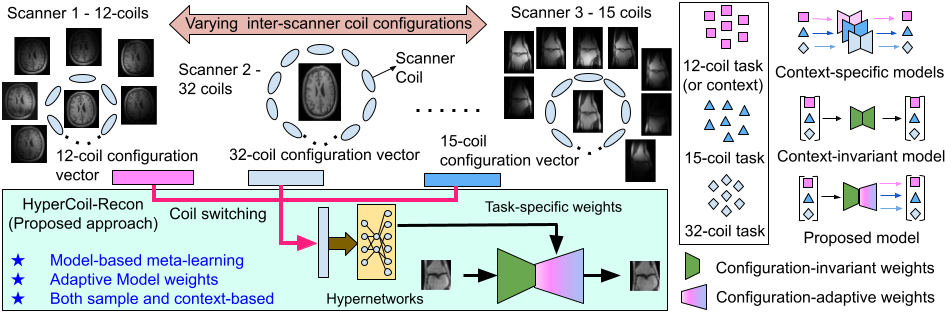

# Universal Coil Configuration-Adaptive model for Multi-coil MRI Reconstruction 
### *Universal Coil Configuration-Adaptive model for Multi-coil MRI Reconstruction using Hypernetworks*
> [HyperCoil-Recon: A Hypernetwork-based Adaptive Coil Configuration Task Switching Network for MRI Reconstruction]()

## Dependencies
#### Packages
* *PyTorch*
* *TensorboardX*
* *numpy*
* *tqdm*
 
An exhaustive list of packages used could be found in the *requirements.txt* file. Install the same using the following command:

```bash
 pip install -r requirements.txt
```

## Folder hierarchies 

The hierarchy is dataset or experiments/<model_name>/results folder

<base_path>/experiments/<model_name>/results/DATASET_TYPE/MASK_TYPE/ACC_FACTOR

<model_name> - this is the folder with the model name in which the model files are stored.
results - this is the folder in which all the predicted test files are stored in .h5 format for each acquisition context.

## Train code 

```bash
sh train.sh
```

## Test code 

```bash
sh valid.sh
```

